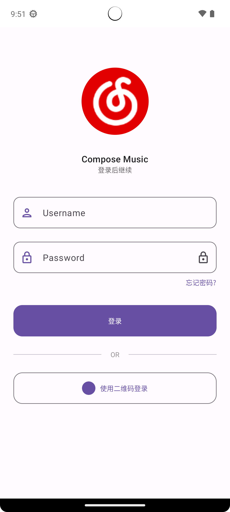
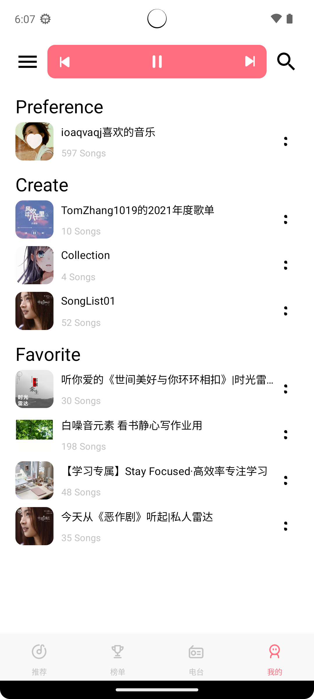
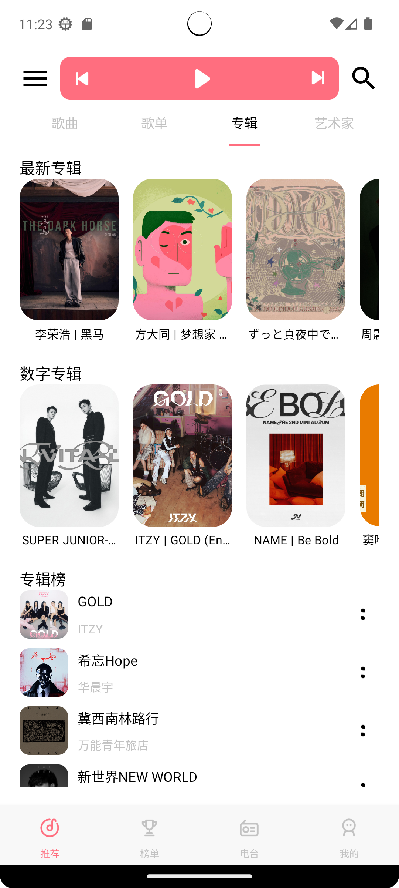
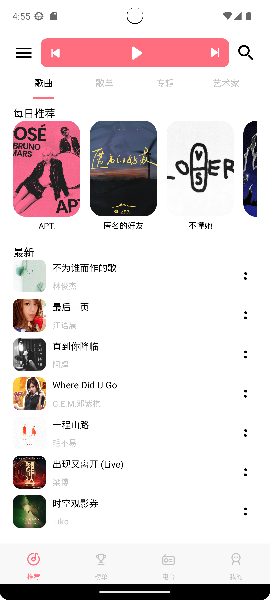
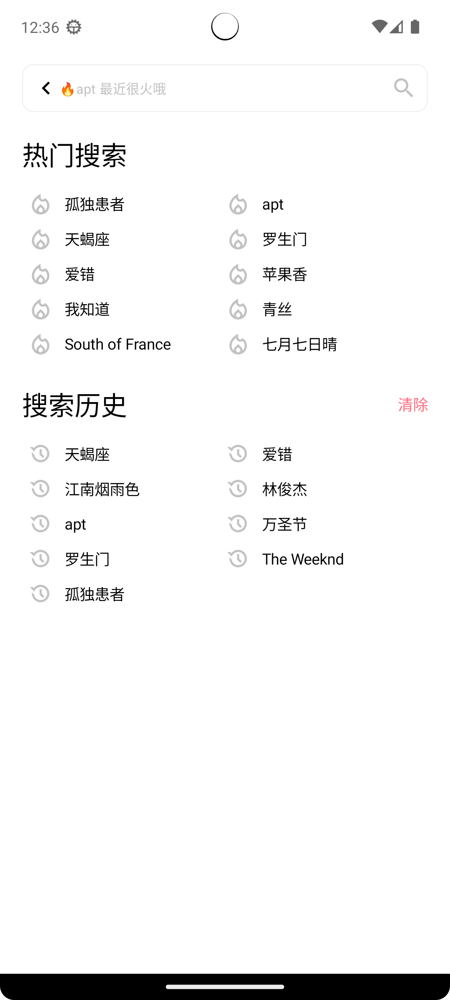
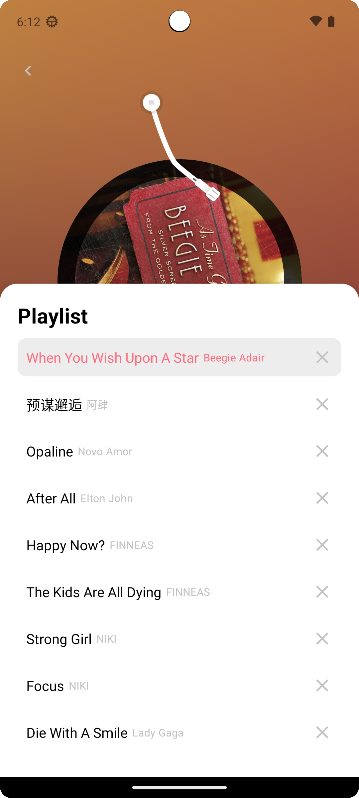
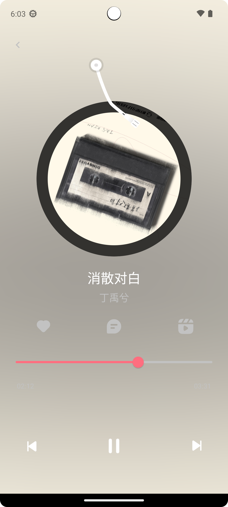
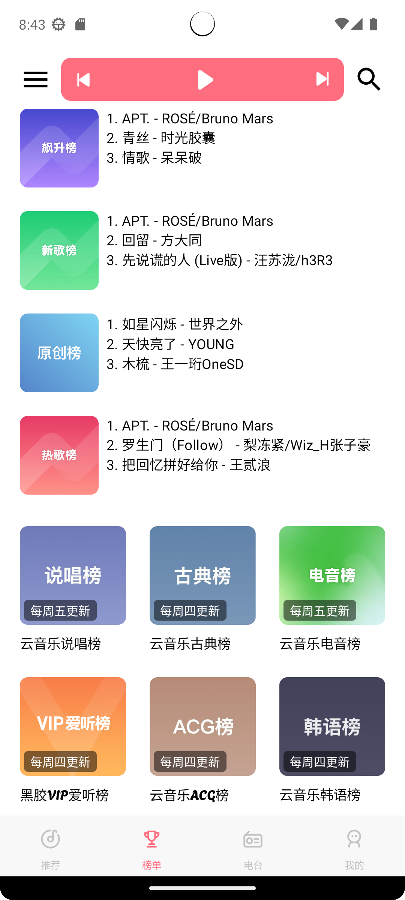
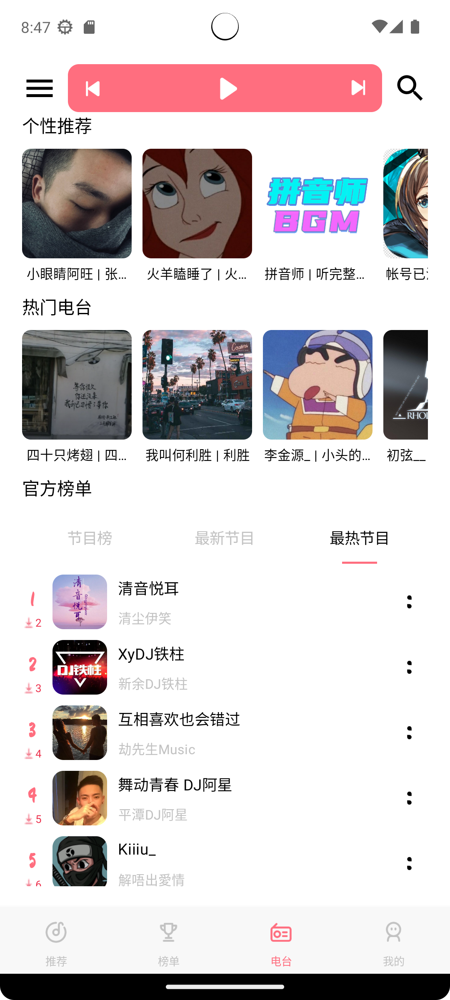
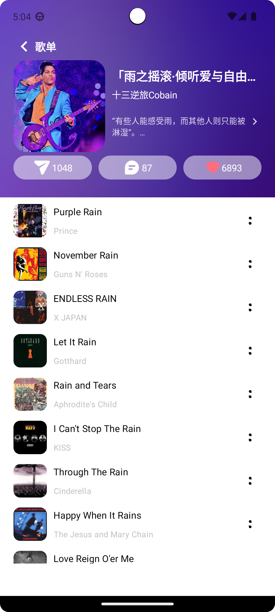

# ComposeMusic

    
    
    

## 项目简介

此项目基 [NeteaseCloudMusicApi](https://gitlab.com/Binaryify/neteasecloudmusicapi) 项目自部署作为API, 使用 Jetpack Compose构建的音乐播放器应用, 采用现代 Android 开发技术栈，通过实践来深入理解
Compose 声明式 UI 的开发模式

此项目需在 di/AppModule 下配置 NeteaseCloudMusicApi 的后端地址

## 功能展示

|            密码登录            |            扫码登录            |         个人页面         |         收藏内容         |
|:--------------------------:|:--------------------------:|:--------------------:|:--------------------:|
|  |  |  |  |

|            专辑推荐            |            歌单推荐            |            歌曲推荐            |            艺术家推荐             |
|:--------------------------:|:--------------------------:|:--------------------------:|:----------------------------:|
|  |  |  |  |

|         搜索界面         |           搜索结果           |           播放列表           |           播放界面           |
|:--------------------:|:------------------------:|:------------------------:|:------------------------:|
|  |  |  |  |

|          榜单          |          电台          |           艺术家主页            |
|:--------------------:|:--------------------:|:--------------------------:|
|  |  |  |

|           歌单内容           |           歌曲评论           |             二级评论             |
|:------------------------:|:------------------------:|:----------------------------:|
|  |  |  |

## 开发环境

- Android Studio Ladybug | 2024.2.1
- Android Gradle Plugin Version 8.1.3
- Gradle Version 8.0
- JDK 17
